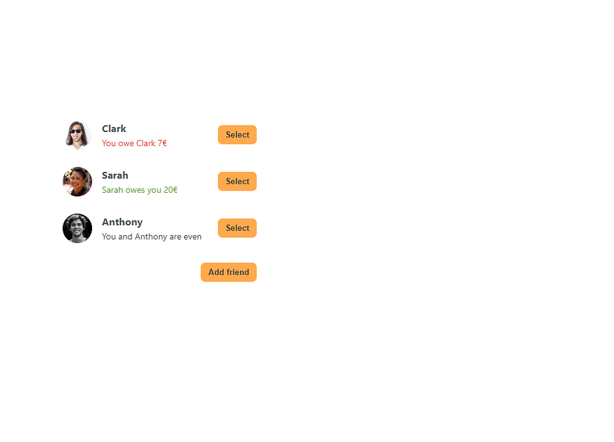
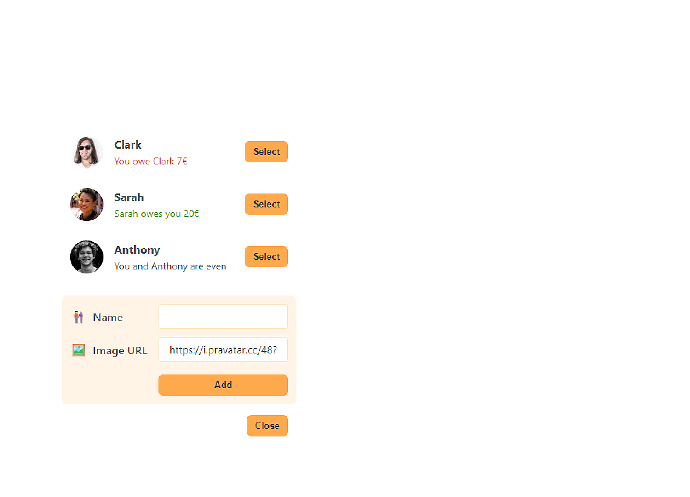
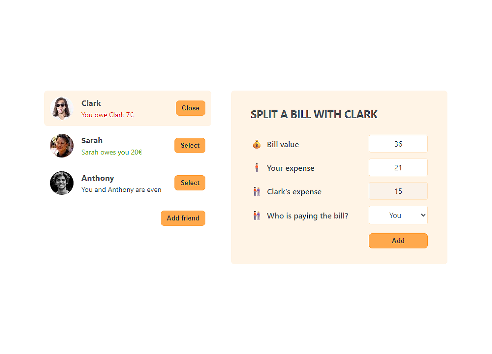

<p align="center">
  
</p>

<p align="center"><a href="#funcionalidades">Funcionalidades</a> • <a href="#demonstração">Demonstração</a> • <a href="#estrutura-do-projeto">Estrutura do Projeto</a> • <a href="#como-executar">Como Executar</a> • <a href="#tecnologias">Tecnologias</a> • <a href="#autoria">Autoria</a></p>

<h1 align="center">Eat 'n Split</h1>

Este é um aplicativo para divisão de contas de restaurante desenvolvido em React como parte do curso do Jonas Schmedtmann. A aplicação permite gerenciar amigos, calcular valores de refeições e dividir despesas de forma intuitiva e prática.

## Funcionalidades

- **Gerenciamento de amigos**: adicione, edite e remova amigos da sua lista;
- **Cálculo de divisão**: divida contas de restaurante de forma justa;
- **Seleção de pagador**: escolha quem pagou a conta e calcule quem deve quanto;
- **Interface intuitiva**: design limpo e fácil de usar;

## Demonstração

<p align="center">
  
  <em>Lista de amigos</em>
</p>
<p align="center">
  
  <em>Adicionando novo amigo</em>
</p>
<p align="center">
  
  <em>Divisão de conta</em>
</p>

## Estrutura do projeto

```Text
src/
|—— assets/
|   |—— data/
|   |   └── friendsList.jsx
|   └── images/
|       |—— demo-01.png
|       |—— demo-02.png
|       |—— demo-03.png
|       └── eat-and-split.png
|—— components/
|   |—— Button.jsx
|   |—— FormAddFriend.jsx
|   |—— FormSplitBill.jsx
|   |—— Friend.jsx
|   └── FriendsList.jsx
|—— utils/
|   └── helpers.jsx
|—— App.jsx
|—— main.css
└── main.jsx
```

## Como executar

```Bash
# Clone o repositório
$ git clone https://github.com/TiLourinho/eat-and-split

# Acesse a pasta do projeto
$ cd eat-n-split

# Instale as dependências
$ npm install

# Execute a aplicação
$ npm run dev

# No navegador
http://localhost:5173/
```

## Tecnologias

- [HTML5](https://developer.mozilla.org/en-US/docs/Web/HTML): estrutura da aplicação;
- [CSS3](https://developer.mozilla.org/en-US/docs/Web/CSS): estilização da aplicação;
- [React](https://react.dev/): biblioteca JavaScript para interface do usuário;
- [Vite](https://vite.dev/): ferramenta de build e desenvolvimento frontend.

## Autoria

Tiago Lourinho

[](https://www.linkedin.com/in/lourinho-tiago/)
[](mailto:lourinho.tiago@gmail.com)
