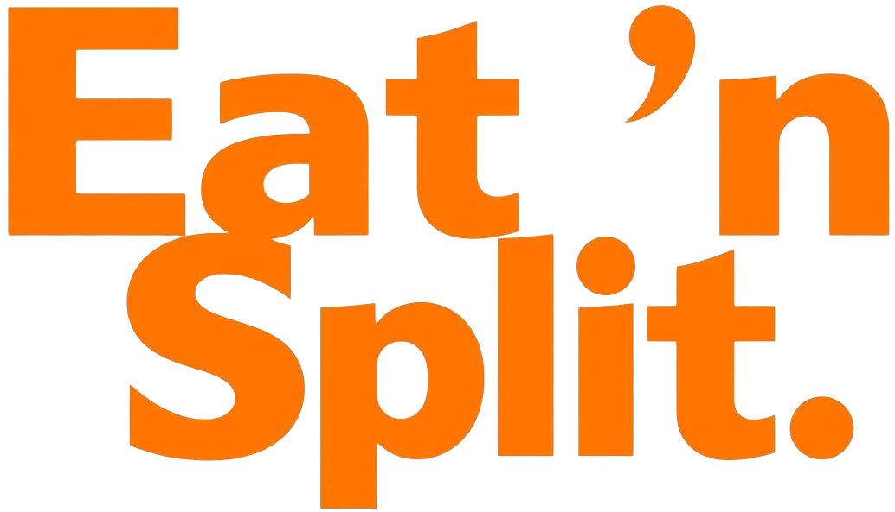

  

<!-- 
 <a href="#funcionalidades">Funcionalidades</a> • <a href="#demonstração">Demonstração</a> • <a href="#estrutura-do-projeto">Estrutura do Projeto</a> • <a href="#como-executar">Como Executar</a> • <a href="#tecnologias">Tecnologias</a> • <a href="#autoria">Autoria</a> 
 -->

 <a href="#funcionalidades">Funcionalidades</a> 

<h1 align="center">Eat 'n Split</h1>

Este é um aplicativo para divisão de contas de restaurante desenvolvido em React como parte do curso do Jonas Schmedtmann. A aplicação permite gerenciar amigos, calcular valores de refeições e dividir despesas de forma intuitiva e prática.

## Funcionalidades

- **Gerenciamento de amigos**: adicione, edite e remova amigos da sua lista;
- **Cálculo de divisão**: divida contas de restaurante de forma justa;
- **Seleção de pagador**: escolha quem pagou a conta e calcule quem deve quanto;
- **Interface intuitiva**: design limpo e fácil de usar;
- **Responsividade**: adaptado para diferentes tamanhos de tela.
